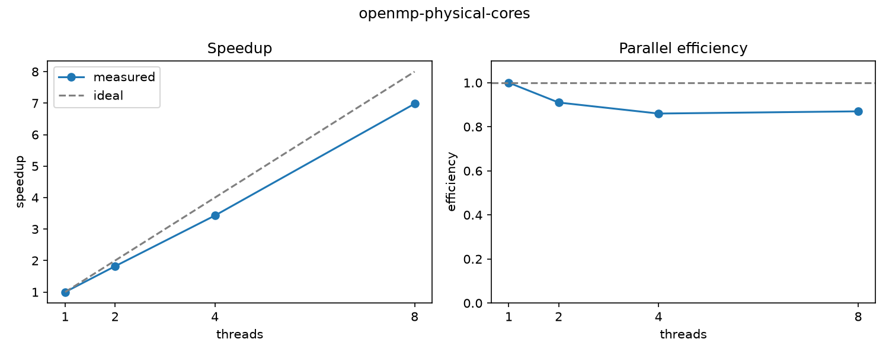

# qhpc-runner

`qhpc-runner` is a restart-safe experiment runner for Slurm.

QHPC is building benchmark and competition workflows on Queen's Frontenac cluster.
Even a simple scaling study quickly becomes a collection of jobs with different resource
requests, repeated runs, partial failures, and results that are easy to separate from the
configuration that produced them.

The runner keeps that experiment state in SQLite, advances it through short `sync` calls, and
reconciles its local state against Slurm rather than assuming an always-running controller
process.

**Validated on Frontenac:** a 12-run OpenMP scaling study reached **6.98x speedup across 8 physical cores (87% parallel efficiency)**. Live cluster testing also validated crash-after-submission recovery without duplicate execution, application-error handling, bounded timeout retry, and reconciliation across hidden Slurm partitions.

## What it does

- expands a YAML experiment definition into deterministic tasks;
- persists experiments, tasks, attempts, and submission tokens in SQLite;
- submits work through `sbatch` with an explicit in-flight cap;
- reconciles active and completed jobs using `squeue` and `sacct`;
- recovers a job submitted immediately before the runner itself crashed;
- retries configured `TIMEOUT` and `OUT_OF_MEMORY` failures within strict limits;
- recognises a *suspected* out-of-memory kill from evidence (SIGKILL at the memory limit) when a
  cluster reports it as a plain `FAILED`;
- never automatically retries ordinary application failures;
- stops cleanly when `sbatch` rejects a job, instead of leaving it half-submitted;
- refuses to run two state-changing commands at once (file lock);
- records per-attempt peak memory and runtime from Slurm accounting;
- turns results into medians, speedup, efficiency, and a chart (`report`);
- exits after every `sync` rather than staying resident on a login node.

The first real workload is an OpenMP scaling study. A separate failure demo exists to exercise
the recovery logic without contaminating the benchmark.

## Architecture

```text
 experiment.yaml
       |
       v
 +-------------+
 | qhpc-run    |
 | plan / sync |
 | status      |
 +------+------+
        |
   +----+------------------+
   |                       |
   v                       v
 SQLite                 Slurm
 experiment             sbatch
 state                   squeue
                         sacct
                           |
                           v
                       Frontenac
```

SQLite and Slurm are independent sources of state. The interesting part of the project is
reconciling them safely when either the jobs or the runner can be interrupted.

## Install

On Frontenac:

```bash
python3 -m venv .venv
source .venv/bin/activate
python -m pip install --upgrade pip
python -m pip install -e .
make -C examples/openmp
```

Check that the cluster commands are available:

```bash
which sbatch squeue sacct scontrol
scontrol ping
```

## OpenMP scaling example

Preview the experiment without submitting anything:

```bash
qhpc-run plan examples/openmp/experiment-physical-cores.yaml
```

The matrix runs 1, 2, 4, and 8 OpenMP threads with three repeats each. The published configuration uses `--hint=nomultithread` so each OpenMP thread is placed on a distinct physical core rather than sharing a core through SMT.

Submit/reconcile up to the configured cap:

```bash
qhpc-run sync examples/openmp/experiment-physical-cores.yaml
```

Check persisted state:

```bash
qhpc-run status examples/openmp/experiment-physical-cores.yaml
```

Run `sync` again later to reconcile completed jobs and submit the next set.

When everything has completed:

```bash
python -m pip install -e ".[report]"   # matplotlib, for the chart
qhpc-run report examples/openmp/experiment-physical-cores.yaml
```

This writes `results/<experiment>-<hash>/` containing `raw.csv`, `summary.csv`, `report.md`,
and `scaling.png`. Repeats are summarised by their median, and the `spread_pct` column shows how
far apart the repeats were: a large spread means the timing is noisy and the median deserves
less trust.

## Results

Measured on Queen's University Frontenac HPC cluster using one OpenMP thread per physical core (`--hint=nomultithread`).

12 completed runs, with three repeats per thread count. Results below use the median elapsed time.

| threads | runs | median elapsed (s) | spread | speedup | efficiency |
|---|---:|---:|---:|---:|---:|
| 1 | 3 | 2.072102 | 1.1% | 1.00x | 100% |
| 2 | 3 | 1.137157 | 1.1% | 1.82x | 91% |
| 4 | 3 | 0.604352 | 1.4% | 3.43x | 86% |
| 8 | 3 | 0.296833 | 0.1% | 6.98x | 87% |

### CPU-affinity validation

An earlier 8-thread run achieved 4.2x speedup. Runtime affinity inspection showed that Slurm had allocated eight logical CPUs across only four physical cores using simultaneous multithreading (SMT).

The experiment was repeated with `--hint=nomultithread`, giving one OpenMP thread per physical core. The resulting 8-core run achieved 6.98x speedup with 87% parallel efficiency.

This distinction was verified using Slurm CPU allocation metadata, `lscpu`, and OpenMP affinity diagnostics.




Public artifacts: [`report.md`](demo/openmp-physical-cores/report.md) · [`summary.csv`](demo/openmp-physical-cores/summary.csv) · [`experiment config`](examples/openmp/experiment-physical-cores.yaml)

## Failure/recovery demo

The failure experiment contains four small tasks:

| task | expected behaviour |
| --- | --- |
| `success` | completes normally |
| `app-error` | exits non-zero and is not retried |
| `timeout` | exceeds its walltime and is eligible for one bounded retry |
| `oom` | exceeds a small memory request and is eligible for one bounded retry when Slurm reports `OUT_OF_MEMORY` or configured suspected-OOM evidence |

On the Frontenac configuration used for live validation, `JobAcctGatherParams=NoOverMemoryKill` meant exceeding requested memory did not trigger a Slurm kill, so OOM recovery is covered by automated scheduler tests rather than claimed as a live cluster result.

### Live validation results

- A deliberate crash immediately after `sbatch` was recovered on the next `sync` by finding the already-accepted Slurm job; no duplicate was submitted.
- An intentional application error was classified as `FAILED_APP` and was not retried.
- A task that exceeded its initial walltime was classified as `TIMEOUT`, retried once with a larger walltime, and completed successfully on attempt two.
- Live deployment exposed hidden Slurm partitions being omitted from the default queue view; reconciliation was updated to use `squeue -a` and a regression test was added.

Preview it:

```bash
qhpc-run plan examples/failure-demo/experiment.yaml
```

### Deliberate crash immediately after submission

For the recovery demo only, the runner contains an explicit failpoint:

```bash
QHPC_RUNNER_CRASH_AFTER_SBATCH=1 \
  qhpc-run sync examples/failure-demo/experiment.yaml
```

The process exits immediately after Slurm accepts one job but before its job ID is stored.

Run:

```bash
qhpc-run sync examples/failure-demo/experiment.yaml
```

again.

The task is already stored as `SUBMITTING` with a unique job name such as:

```text
qhpc-e1-t3-a1-7ac19e
```

`sync` searches both current queue state and Slurm accounting history, recovers the accepted
job by that submission token, and does not blindly submit a duplicate.

## Why `sync` instead of a daemon?

The runner intentionally does not stay alive on Frontenac's login environment. Slurm already
owns long-running computation. A `sync` invocation:

1. opens durable state;
2. reconciles it against the scheduler;
3. classifies finished attempts;
4. applies bounded retry rules;
5. submits only enough ready work to reach the in-flight cap;
6. persists changes;
7. exits.

That design makes restart recovery part of the normal execution model instead of an exceptional
case.

## Retry policy

Automatic retry is deliberately conservative.

| state | action |
| --- | --- |
| `COMPLETED` | persist success; never rerun |
| `TIMEOUT` | optional bounded retry with a larger walltime |
| `OUT_OF_MEMORY` | optional bounded retry with a larger memory request |
| suspected OOM | `FAILED`, killed by SIGKILL (exit 137 or signal 9), peak memory at 90%+ of the request; retried only with `include_suspected: true` |
| `FAILED` | application failure; no automatic retry |
| `CANCELLED` / `NODE_FAIL` / `PREEMPTED` | recorded; no automatic retry in the MVP |
| unknown | preserve evidence; do not guess |

The demo configuration caps attempts and resource growth. An OOM or timeout may indicate a
bad application, so adding resources is not treated as universally correct.

## Submission recovery

There is a small but important failure window:

```text
persist SUBMITTING + token
          |
          v
        sbatch
          |
          v
      Slurm accepts
          |
        CRASH
          |
          v
job ID was never persisted
```

The unique token is written before the external side effect and used as the Slurm job name.
On the next `sync`, the runner queries scheduler/accounting state from the experiment's start
time and reconnects the persisted task to the existing job.

If a `SUBMITTING` task cannot be found, the runner leaves it ambiguous rather than automatically
creating another copy, and `status` lists it under "Needs attention". After checking
`squeue -a -u $USER` yourself:

```bash
qhpc-run resolve examples/failure-demo/experiment.yaml <task> --resubmit   # or --abandon
```

A resubmitted task gets a fresh token, so a late-appearing copy of the old job can never be
mistaken for the new one. If the token matches more than one job, the runner also refuses to
guess and reports every match.

If `sbatch` itself rejects a job (wrong account, invalid partition), nothing reached the queue.
The runner marks that task `SUBMIT_ERROR` and stops submitting for this sync, since the same
error would almost certainly repeat for every task.

## Shared-cluster behaviour

Every experiment has `max_in_flight`. `PENDING`, `RUNNING`, and `SUBMITTING` tasks count
against that cap. The runner therefore does not treat a shared Slurm queue as an unlimited API.

The Slurm adapter also performs one accounting snapshot for the experiment time window per
`sync`, instead of issuing a separate `sacct` query for every task.

## Only one runner at a time

`sync` and `resolve` take an exclusive lock on `.qhpc_runner/runner.lock`. Two overlapping syncs
could both see the same task as ready and both submit it, so instead of documenting "don't do
that", the runner makes it impossible.

## Slurm behaviour worth knowing

Things this project had to handle that are easy to get wrong:
- Hidden Slurm partitions are omitted from the default `squeue` view on some clusters. The runner queries `squeue -a` so live jobs in those partitions are still visible during reconciliation.

- **Memory is reported per step.** In `sacct`, the job's own line has no `MaxRSS`; the
  `.batch` step line does. Reading only the job line reports zero memory for every job.
- **`sacct` only looks back to midnight by default.** Recovery queries pass `-S` with the
  experiment's start time, or a job that finished while the runner was down would be invisible.
- **Time limits are whole minutes.** A 90-second request becomes 2 minutes, and enforcement has
  some slack, so the runner rounds up explicitly and the timeout demo sleeps well past its limit.
- **Out-of-memory behaviour depends on cluster policy.** The runner handles explicit `OUT_OF_MEMORY` states and can optionally infer suspected OOM from SIGKILL plus memory evidence. On the Frontenac configuration used for live validation, `NoOverMemoryKill` meant exceeding requested memory did not itself trigger a Slurm memory kill.
- **Compile for the compute nodes, not the login node.** `-march=native` on a login node can
  produce a binary that dies with "Illegal instruction" on a compute node with a different CPU.
- **Editing the YAML starts a new experiment.** Experiments are identified by a hash of their
  configuration, so a changed resource request can never be silently mixed into old results.

## Why SQLite?

This is currently a single-user QHPC experiment tool. SQLite gives it transactional, durable
state without requiring another service to be installed or operated.

## Why not Snakemake, Nextflow, or Submitit?

Those are mature tools and better choices for many real workflows. This project is intentionally
narrow: it exists to explore experiment reproducibility, scheduler-state reconciliation,
idempotent submission, bounded failure recovery, and Slurm behaviour directly.

## Tests

The unit tests use a fake scheduler; CI does not need Frontenac.

They cover:

- in-flight submission cap, and the lock against concurrent syncs;
- completed work is never duplicated;
- recovery of a `SUBMITTING` task by its scheduler token, and refusing to guess on duplicates;
- manual resolution with a fresh token;
- bounded timeout and OOM retries, including the walltime ceiling;
- suspected-OOM detection, and that a low-memory kill is *not* treated as OOM;
- application errors are never retried; `sbatch` rejections stop submission;
- parsing real-shaped `sacct` output, including memory from the batch step;
- hidden-partition reconciliation through `squeue -a`, added as a regression test after the issue was found on Frontenac;
- an earlier attempt is never re-classified after a retry (a regression test for a bug found
  when running against a real Slurm cluster);
- speedup and efficiency calculations in `report`.

Run:

```bash
python -m unittest discover -s tests -v
```

## Known limitations

- single-user experiment state; one runner should manage a given experiment database;
- not a claim of exactly-once execution under every scheduler/database/network failure;
- ambiguous submission state is preserved rather than automatically duplicated;
- suspected OOM is a heuristic; it is opt-in and reported with its evidence;
- retries are demonstration policies, not automatic resource optimization;
- no job arrays, DAG dependencies, or MPI workload support yet;
- `MaxRSS` is sampled by Slurm, so very short jobs may report no memory figure;
- OpenMP measurements on shared infrastructure should not be interpreted as controlled
  dedicated-node benchmark results.

## Roadmap

Useful next steps for QHPC:

1. add Slurm job-array support for homogeneous task matrices;
2. add MPI experiment support;
3. record environment metadata (compiler, modules, git commit) alongside results;
4. suggest resource requests from past `MaxRSS` and runtime instead of fixed multipliers;
5. add competition benchmark configurations as QHPC's 2027 preparation develops.
